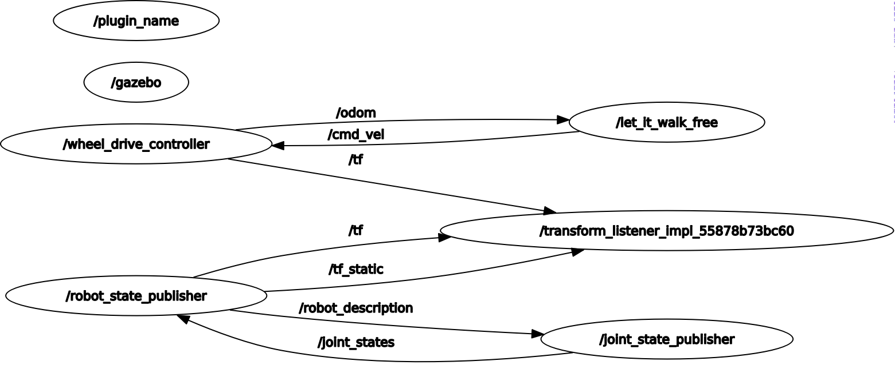

# **Research Track Assignment 2 part 2**

* this repositry simply utilizes a ros2 publisher to move a robot in a simulation environment with a simple GUI


<br/>

## Project Structure




## **OverView**

### **Nodes**
1. **move_robot node** 
- this node is a simple publisher that can publish vel_x ang_vel_z speeds to the robot
- implements a simple tkinter GUI for better ability to publish speeds because when running a launch file the gui in the terminal is very ambigious 

2. **launch_sim.launch.py**
- this launch file launches the gazebo.launch.py file from the robot_urdf package and the python node created in the assignment2_pt2 package in order to run the entire simulation
---
## **Installation and running**
- **Dependencies:**
  - ROS2 foxy
  - tkinter
  - gazebo

- **make sure all scripts and launch files are executable after cloning**
- **steps:**
  - `sudo apt install python3-tk`
  - `cd <colcon_workspace>/src`
  - ```bash
  	git clone https://github.com/Melasmar-711/Research_Track_assignment2_pt2.git
  	cd ..
  	colcon build
  	ros2 launch assignment2_pt2 launch_sim.launch.py
---
## Simulation Output
<br/>

[](https://youtu.be/_7aJQuSJX6o)

